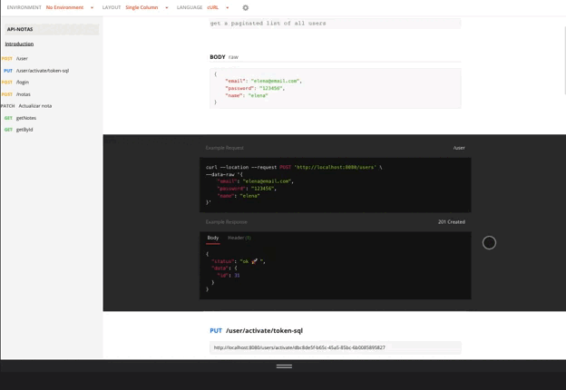

## BACKEND 📌

### App de Notas de texto.
## Descripción 📑 
Implementar una API que permita publicar notas privadas de texto y categorizarlas

## Anónimo: 👨 

- Login: usando email + contraseña
- Registro: pide email + contraseña

## Usuarios Registrados: 👨‍🦲 👩 

- Ver su listado de notas (en el listado sólo se ven los títulos)
- Visualizar una nota
- Crear una nota: título, texto y categoría única (fijas).
- Modificar sus notas: título, texto y categoría

## Instrucciones: 

- Instalación:

        npm install

- Es necesario crear archivo .env donde se alojan variables de entorno (se anexa .env.example para revisión): 

        .env.example

- Creación base de datos e introducir datos de prueba:

        npm run initDB
        npm run populateDB

- Iniciar servidor:

        npm run dev

## Postman Documentation:

[Postman Url 🚀 ](https://documenter.getpostman.com/view/14647301/UzQmxowC)

## Dependencias y herramientas 🧰 

* Node
* Postman
* bcrypt
* cors
* dotenv 
* express  
* morgan  
* mysql2 

## Authors 🚀 

* Cecilia Carbajal.
* Calixto Lópex.
## Gratitud 🎁
* Comparte este proyecto 📢 .
* Made with ❤️ by [Cecilia Carbajal](https://github.com/belcar-ceci/belcar_ceci_portfolio.git) y [Calixto López ](https://github.com/CalixtoLopez)
